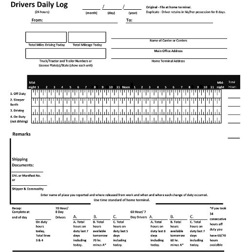

# Spotter AI - Intelligent ELD Trip Planner & HOS Calculator

Spotter AI is a premium, automated route-logging and Hours of Service (HOS) management platform designed for the modern trucking industry. It streamlines the creation of ELD-compliant logbooks through intelligent route planning and automatic status generation.

[](https://github.com/shivamsahu-tech/spotter-ai-assessment)

## 🚀 Key Features

- **🚛 Automated Route Logs**: Generate complete trip logs with zero manual data entry. Just input your coordinates and the engine handles the rest.
- **🗺️ Intelligent Waypoint Picking**: Interactive map interface for setting current location, pickup, and drop-off points.
- **⚖️ Precise HOS Calculation**: Built-in engine that calculates driving time, on-duty/off-duty cycles, and sleeper berth requirements.
- **📄 ELD-Ready PDF Generation**: Instantly generate professional, compliant ELD logbook PDFs with reverse-geocoded location data.
- **✨ Premium Visualized Dashboards**: High-fidelity map views with route geometry, fuel stops, and animated route progress.

---

## 🛠️ Technology Stack

### Frontend
- **Framework**: [React 19](https://react.dev/) (Vite)
- **Language**: [TypeScript](https://www.typescriptlang.org/)
- **Animations**: [GSAP](https://greensock.com/gsap/) (GreenSock Animation Platform)
- **Mapping**: [Leaflet](https://leafletjs.com/) & [React Leaflet](https://react-leaflet.js.org/)
- **UI Components**: [Material UI](https://mui.com/) & [Tailwind CSS](https://tailwindcss.com/)
- **Icons**: [Lucide React](https://lucide.dev/)

### Backend
- **Framework**: [Django 6.0](https://www.djangoproject.com/)
- **PDF Engine**: [fpdf](http://www.fpdf.org/) & [Pillow](https://python-pillow.org/)
- **Geolocation**: [GeoPy](https://geopy.readthedocs.io/)
- **Database**: SQLite (Development)

---

## 📦 Installation & Setup

### Prerequisites
- Python 3.10+
- Node.js 18+

### 1. Server Setup (Django)
```bash
cd server
python -m venv venv
source venv/bin/activate  # On Windows: venv\Scripts\activate
pip install -r requirements.txt
python manage.py migrate
python manage.py runserver
```

### 2. Client Setup (Vite + React)
```bash
cd client
npm install
npm run dev
```

---

## 📸 visual Preview

### Professional ELD Logbook
The system generates in-depth, compliant logs with full geographic resolution.


### Automated Workflow
From route planning to PDF generation, the entire workflow is handled automatically.



---

## 🔗 Project Links

- **Repository**: [shivamsahu-tech/spotter-ai-assessment](https://github.com/shivamsahu-tech/spotter-ai-assessment)


## 📝 License
This project is for assessment purposes. Refer to the repository for licensing information.
